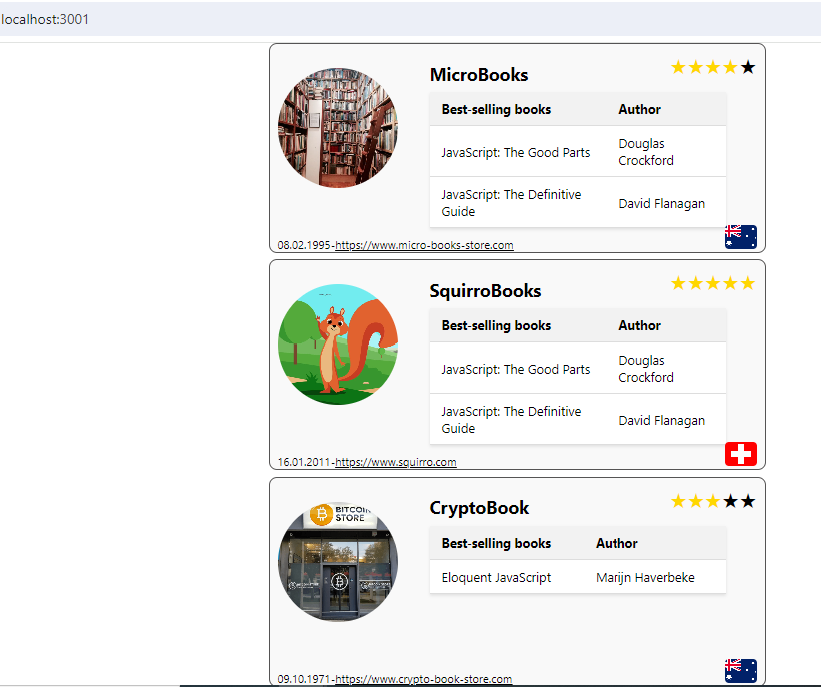

# Getting Started with Book Store App

This project provides the frontend for the information of different Bookstores.
To install the necessary modules run the command below:
`npm install`

To run, you have to start the App with:
`npm start`

Make sure that you run the book-store-api first. If the book-store-api runs on the port 3000, start this application on another port. 
Please use port 3001 for this.

`PORT=3001 npm start`

This should open the application on localhost:3001, should looks like as given below 
